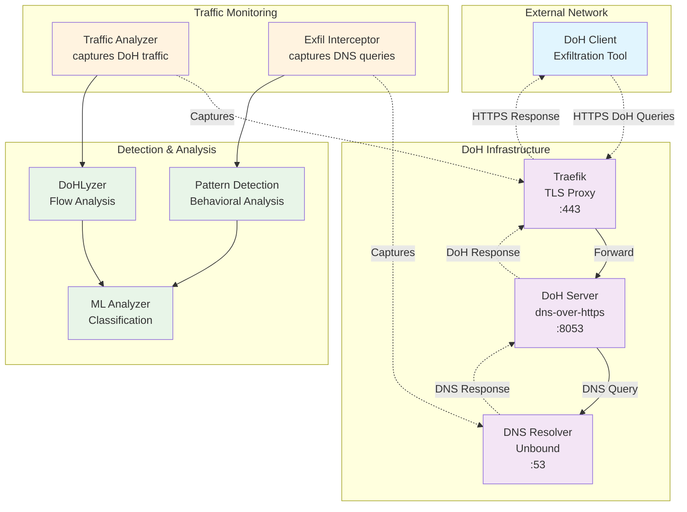

# DoHExfTlk: DNS-Over-HTTPS Exfiltration Toolkit

[](https://www.docker.com/)
[](https://python.org/)
[](#legal-disclaimer)

---

## ⚠️ Legal Disclaimer

> **EDUCATIONAL AND RESEARCH USE ONLY**  
> This toolkit is intended exclusively for:
> - Academic research
> - Cybersecurity training
> - Authorized testing in **controlled environments**
>
> **You agree to:**
> - Use this toolkit only on systems you own or have explicit written permission to test
> - Comply with all applicable laws and regulations
> - Accept full responsibility for your actions and their consequences  
>
> **The author disclaims any liability** for malicious, illegal, or unauthorized use.

---

## 📑 Table of Contents
- [Overview](#overview)
- [System Architecture](#system-architecture)
- [Quick Start](#quick-start)
- [Main Components](#main-components)
- [Detection Features](#detection-features)
- [Machine Learning Workflow](#machine-learning-workflow)
- [Configuration Management](#configuration-management)
- [Security Considerations](#security-considerations)
- [Development & Contribution](#development--contribution)
- [Roadmap](#roadmap)
- [License & Citation](#license-and-citations)

---

## Overview

DoHExfTlk is a **research-oriented platform** for studying and detecting data exfiltration via **DNS-over-HTTPS (DoH)**.  
It combines:

- **Network traffic capture**
- **Behavioral analysis**
- **Machine learning classification**
- **Data reconstruction**

**Use cases:**
- Academic research
- Cybersecurity training labs
- Benchmarking detection methods

---

## System Architecture



---

## Quick Start

### Prerequisites
- **Docker** & **Docker Compose**
- Linux / macOS (or WSL2 for Windows)
- At least **4 GB RAM**

### Installation
```bash
# 1. Clone repository
git clone git@github.com:AdamLBS/DohExfTlk.git
cd DoHExfTlk

# 2. Generate TLS certificates
chmod +x generate_certs.sh
./generate_certs.sh

# 3. Start infrastructure
docker compose up -d
```

### Verification
```bash
# Check running services
docker compose ps

# Test DoH server
docker exec -it client_test bash /scripts/test_doh.sh

# Run exfiltration test
docker exec -it client_test bash /scripts/test_exfiltration.sh
```

---

## Main Components

### DoH Infrastructure
- **DoH Server** with TLS
- **DNS Resolver** (Unbound)
- **TLS Proxy** (Traefik)

### Detection & Analysis
- **Traffic Analyzer** (pcap capture + flow extraction)
- **Exfiltration Server** (pattern detection + data reconstruction)
- **DoHLyzer** (behavioral analysis)
- **ML Analyzer** (model training & prediction)

### Clients & Testing
- **Configuration Generator** (`config_generator.py`)
- **Exfiltration Client** (encoding + evasion techniques)
- **Predefined Test Scenarios**
- **Automated Test Scripts**

---

## Detection Features

### Traditional Detection
- **Pattern analysis**: suspicious DNS label structures
- **Temporal analysis**: irregular timing patterns
- **Content analysis**: encoded payload detection

---

## Machine Learning Workflow

### Training Phase
```bash
cd ml_analyzer
python3 trainer.py --quick --fpr 0.01
# Models saved in /models/
```

### Detection & Classification Phase
```bash
# 1. Analyze traffic with DoHLyzer
# 2. Filter detected queries
cd exfiltration/client
./filter_detection_csv.sh

# 3. Classify with trained models
cd ../../ml_analyzer
python3 predict.py ../traffic_analyzer/output/filtered_output.csv
```

**ML pipeline goal:** confirm whether detected flows are malicious or benign.

---

## Configuration Management

### Create or Manage Configurations
```bash
cd exfiltration/client

# Create interactively
python config_generator.py --create

# List available
python config_generator.py --list

```

**Example Configuration (APT Simulation)**:
```json
{
  "name": "APT Simulation",
  "exfiltration_config": {
    "doh_server": "https://doh.local/dns-query",
    "target_domain": "update-service.local",
    "chunk_size": 8,
    "encoding": "base32",
    "timing_pattern": "random",
    "base_delay": 30.0,
    "encryption": true,
    "domain_rotation": true,
    "backup_domains": [
      "security-updates.local",
      "maintenance-api.local"
    ]
  }
}
```

---

## Security Considerations
- Run **only** in isolated lab environments (as this code uses insecure Docker feature and exposes the host's Docker socket to some containers)
- Never connect to production networks
- Use VM snapshots or containers for quick reset
- Ensure **all participants** have legal authorization

---

## Development & Contribution

**Code Structure**
```
├── exfiltration/      # DoH exfiltration Clients & servers
├── ml_analyzer/       # ML training & prediction
├── traffic_analyzer/  # DoH Traffic analysis
├── datasets/          # Training datasets
└── docs/              # Documentation
└── models/            # Trained ML models
└── client_scripts/    # Scripts that can be ran in the client container
└── datasets/              # Dataset files for training


```

---

## Roadmap

**v1.0**
- Complete DoH infra
- Pattern detection
- Basic ML models
- Data reconstruction

**Future**
- Real-time detection
- Deep learning
- Web monitoring dashboard
- REST API integration

---

## License and Citations

If used in academic work, please cite:
```bibtex
@misc{dohexftlk-2025,
  title={DNS-Over-HTTPS Exfiltration and Evasion Toolkit},
  author={Adam Elaoumari},
  year={2025},
  institution={University of Kent - Canterbury},
  note={MSc Cyber Security Dissertation Project}
}
```

---