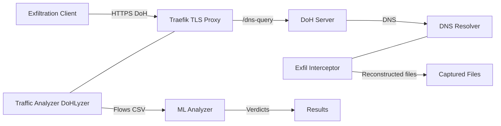

# DoHExfTlk — Technical Architecture

## 1) Overview
- Goal: **study & detect data exfiltration over DNS‑over‑HTTPS (DoH)** in a lab.
- Stack: **Traefik (TLS) → DoH Server → DNS Resolver**, with **dual monitoring** and **ML validation** (on flows only).
- Outputs: flow CSVs, **reconstructed files** (from resolver side), predictor logs, and per‑model stats.

---

## 2) High‑Level Diagram

**Reading guide:** Client sends DoH to Traefik → forwarded to DoH Server → queries DNS Resolver.  
**Traffic Analyzer** listens near Traefik (encrypted side) and writes **flow CSVs** → **ML Analyzer** scores those flows.  
**Exfil Interceptor** listens near the **Resolver** (clear DNS) and **only saves reconstructed files** to `/app/captured` (it is **not** connected to the ML flow).

---

## 3) Components at a Glance
| Component | Purpose |
|---|---|
| **Traefik** | TLS termination and routing for DoH (`/dns-query`) |
| **DoH Server** | Handles DoH requests and forwards to resolver |
| **DNS Resolver** | Internal DNS (e.g., Unbound) |
| **Traffic Analyzer (DoHLyzer)** | Captures DoH traffic, extracts features/flows, exports CSV |
| **Exfil Interceptor** | Watches resolver side, parses chunks, **reconstructs & saves files** to `/app/captured` (no ML) |
| **ML Analyzer** | Trains & runs models on **flows**, applies tuned thresholds, outputs per‑model stats |
| **Exfiltration Client** | Generates test traffic from JSON configs (encodings, timing, etc.) |

---

## 4) Ports & Endpoints
| Service | Port(s) | Notes |
|---|---|---|
| **Traefik** | 443 (HTTPS), 80 (HTTP), 8080 (UI, optional) | DoH endpoint: **`/dns-query`** |
| **DoH Server** | 8053 (internal) | HTTP behind Traefik |
| **DNS Resolver** | 53 TCP/UDP (internal) | Internal only |

---

## 5) Data Flow (5 steps)
1. **Client → Traefik (HTTPS/DoH)**: requests hit `/dns-query` with TLS.
2. **Traefik → DoH Server**: forwards to the DoH app.
3. **DoH Server → Resolver**: translates to DNS queries.
4. **Monitoring**:  
   - **Traffic Analyzer** (near Traefik) → **flow CSV** (DoHLyzer).  
   - **Exfil Interceptor** (near Resolver) → **reconstructs files to `/app/captured`** (no ML path).
5. **ML Validation (flows only)**: `predict.py` ingests CSV, applies per‑model thresholds, prints **malicious/benign** counts and detection rates.

---

## 6) Minimal Ops Notes
- **Isolate the lab**; do not expose services to production networks.
- For quick tests, use `curl -k` or import the generated **lab CA**.
- Default artifacts: `traffic_analyzer/output/*.csv`, `exfiltration/client/results/run-*/`, **reconstructed** files under `/app/captured/` (inside the interceptor container).